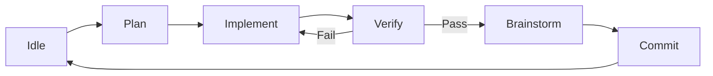

<div align="center">

# Agent Pump ⛽

### The Automated AI Coding Orchestrator

[](https://www.python.org/downloads/release/python-3120/)
[](https://opensource.org/licenses/MIT)
[](https://github.com/astral-sh/ruff)
[](https://github.com/Textualize/textual)

**Stop copying and pasting code. Start orchestrating intelligence.**

[Introduction](#introduction) • 
[Features](#features) • 
[Installation](#installation) • 
[Usage](#usage) • 
[How It Works](#how-it-works) • 
[Roadmap](#roadmap)

</div>

---

## Introduction

**Agent Pump** is a terminal-based orchestration platform that turns your AI coding assistants into autonomous agents. 

Instead of treating AI as a chat bot where you copy-paste snippets back and forth, Agent Pump puts the AI in a **Workflow Loop**. You define the endpoint (the `ROADMAP.md`), and Agent Pump drives the AI through a rigorous 5-phase engineering process until the feature is built, tested, and committed.

It feels less like "chatting with a bot" and more like **pair programming with a senior engineer** who types really, really fast.

> "Imagine a world where you write the roadmap, and the AI pumps out the code. That world is here."

## Features

- **🚀 Autonomous Workflow Loop**: Automatically cycles through **Plan → Implement → Verify → Brainstorm → Commit**.
- **🖥️ Beautiful TUI Dashboard**: A rich terminal interface built with Textual to monitor multiple projects simultaneously.
- **🧠 Pluggable Intelligence**: Currently powered by the **Gemini CLI**, with architecture ready for Claude Code and OpenCode.
- **✅ Automated Verification**: Runs your tests, linters, and build commands. If they fail, the agent fixes the code automatically.
- **⚙️ Custom Verification Commands**: Configure project-specific build, lint, and test commands via `.agent-pump.yml` or through the TUI.
- **📋 Copy Configuration**: Easily copy backend and prompt settings between projects or apply a configuration to your entire workspace.
- **📝 Living Roadmap**: The agent doesn't just write code; it reads your `ROADMAP.md` to decide what to work on next.
- **⚡ "YOLO" Mode**: Option to fully automate the process or require manual approval at key checkpoints.
- **🛡️ Safety First**: All changes are sandboxed in git branches. The agent commits its own work with conventional commit messages.

## Installation

Agent Pump is built with modern Python packaging tools. We recommend using `uv` for the best experience.

```bash
# Clone the repository
git clone https://github.com/yourusername/agent-pump.git
cd agent-pump

# Install dependencies and sync virtual environment
uv sync
```

Alternatively, you can use pip:

```bash
pip install -e .
```

## Usage

### 1. Initialize a Project

Agent Pump thrives on structure. Ensure your project has a `ROADMAP.md` file. This is the agent's "fuel". 

```markdown
# ROADMAP.md

## Current Sprint
### 🔴 Add Login Page
Create a login page with email and password fields.
```

### 2. Launch the Pump

Start the TUI dashboard:

```bash
uv run agent-pump
```

### CLI Commands

You can also manage projects directly from the command line:

```bash
# Add a project
uv run agent-pump project add ./my-project

# Remove a project
uv run agent-pump project remove ./my-project

# List managed projects
uv run agent-pump project list

# Run with specific projects (launches TUI)
uv run agent-pump ./my-project ./another-project
```

### Verification Commands

Configure custom build, lint, and test commands for your projects to ensure code quality:

#### CLI Configuration

```bash
# Set build command for a project
uv run agent-pump verification set-build ./my-project "npm run build"

# Set lint command for a project
uv run agent-pump verification set-lint ./my-project "npm run lint"

# Set test command for a project
uv run agent-pump verification set-test ./my-project "npm test"

# Toggle skip verification for a project
uv run agent-pump verification toggle-skip ./my-project --enable

# Show current verification configuration
uv run agent-pump verification show ./my-project

# Detect project type and suggest appropriate commands
uv run agent-pump verification detect ./my-project
```

#### File-Based Configuration

You can also configure verification commands in your `.agent-pump.yml` file:

```yaml
verification:
  build_cmd: "npm run build"
  lint_cmd: "npm run lint"
  test_cmd: "npm test"
  skip_verification: false
```

#### Example Configurations

**JavaScript/TypeScript Project:**
```yaml
verification:
  build_cmd: "npm run build"
  lint_cmd: "npm run lint"
  test_cmd: "npm run test:unit"
  skip_verification: false
```

**Python Project:**
```yaml
verification:
  build_cmd: "python -m build"
  lint_cmd: "ruff check . && mypy src/"
  test_cmd: "pytest tests/ -v"
  skip_verification: false
```

**Rust Project:**
```yaml
verification:
  build_cmd: "cargo build"
  lint_cmd: "cargo clippy --all-targets --all-features"
  test_cmd: "cargo test --all-targets --all-features"
  skip_verification: false
```

**Go Project:**
```yaml
verification:
  build_cmd: "go build ./..."
  lint_cmd: "golangci-lint run ./..."
  test_cmd: "go test ./... -v"
  skip_verification: false
```

**Java/Maven Project:**
```yaml
verification:
  build_cmd: "mvn compile"
  lint_cmd: "mvn checkstyle:check"
  test_cmd: "mvn test"
  skip_verification: false
```

**Java/Gradle Project:**
```yaml
verification:
  build_cmd: "gradle build"
  lint_cmd: "gradle check"
  test_cmd: "gradle test"
  skip_verification: false
```

**C++/Make Project:**
```yaml
verification:
  build_cmd: "make"
  lint_cmd: "cppcheck --enable=all src/"
  test_cmd: "make test"
  skip_verification: false
```

Verification commands run in sequence (build → lint → test) after the AI verification phase. If any command fails, the workflow enters an error state and the AI agent will attempt to fix the issue.

The system includes security validation to prevent dangerous command patterns like `||`, `&&`, `;`, `$()`, and backticks to prevent command injection attacks.

### 3. Orchestrate

1.  Use the **TUI** to add your project directory.
2.  Select the project.
3.  Watch as Agent Pump:
    *   Reads the `ROADMAP.md`.
    *   **Plans** the implementation.
    *   **Writes** the code.
    *   **Verifies** the build.
    *   **Commits** the changes to git.

### Key Bindings

| Key | Action |
| :--- | :--- |
| `a` | **Add** a new project |
| `r` | **Remove** the selected project |
| `p` | **Pause/Resume** all workflows |
| `s` | **Start** workflows (or Resume specific) |
| `k` | **Skip** current feature (mark as failed) |
| `q` | **Quit** the application |


## How It Works

Agent Pump implements a state machine that models the software engineering lifecycle:



1.  **PLAN**: The agent analyzes the codebase and creates an implementation plan.
2.  **IMPLEMENT**: Code is written and scaffolding is generated.
3.  **VERIFY**: Tests and linters are run. If there are errors, the agent loops back to *Implement* with the error logs.
4.  **BRAINSTORM**: The agent reviews its own work and looks for improvements or follow-up tasks.
5.  **COMMIT**: Changes are staged and committed to git with a descriptive message.

## Development

### Prerequisites

-   **Python 3.12+**: This project requires Python 3.12 or newer.
-   **uv**: We use `uv` for dependency management. [Install uv](https://github.com/astral-sh/uv).

### Setup

1.  Clone the repository:
    ```bash
    git clone https://github.com/yourusername/agent-pump.git
    cd agent-pump
    ```

2.  Sync dependencies and create virtual environment:
    ```bash
    uv sync
    ```

### Static Analysis

We run a strict ship. Please run these commands before submitting a PR:

-   **Linting (Ruff)**:
    ```bash
    uv run ruff check .
    ```

-   **Type Checking (Pyright)**:
    ```bash
    uv run pyright
    ```

### Testing

Run the test suite with pytest:

```bash
# Run all tests
uv run pytest tests/ -v

# Run unit tests only
uv run pytest tests/unit/ -v
```

### Pre-commit Checklist

Before pushing your changes, ensure you pass the full verification suite:

1.  [ ] `uv run ruff check .` (Linting)
2.  [ ] `uv run pyright` (Type Checking)
3.  [ ] `uv run pytest tests/ -v` (Tests)

## Contributing

We are building the future of agentic coding. Contributions are welcome!

Please read our [BEST_PRACTICES.md](BEST_PRACTICES.md) to understand our engineering philosophy and coding standards.

## Roadmap

See [ROADMAP.md](ROADMAP.md) for the active development plan. Yes, we use Agent Pump to build Agent Pump. 🤯
