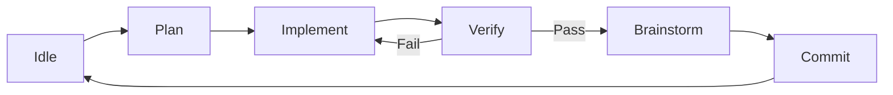

<div align="center">

# Agent Pump ⛽

### The Automated AI Coding Orchestrator

[](https://www.python.org/downloads/release/python-3120/)
[](https://opensource.org/licenses/MIT)
[](https://github.com/astral-sh/ruff)
[](https://github.com/Textualize/textual)

**Stop copying and pasting code. Start orchestrating intelligence.**

[Quick Start](#quick-start) • 
[Features](#features) • 
[How It Works](#how-it-works) • 
[CLI Reference](#cli-reference) • 
[Documentation](#documentation)

</div>

---

## 🚀 Introduction

**Agent Pump** is a terminal-based orchestration platform that transforms standard AI coding assistants into fully autonomous agents.

Instead of treating AI as a conversational chatbot where you endlessly copy and paste snippets, Agent Pump embeds the LLM into a rigorous **CI/CD-like Workflow Loop**. You define your end goals in a simple `ROADMAP.md`, and Agent Pump continuously drives the AI through a 5-phase engineering lifecycle until your feature is architected, implemented, automatically verified, and committed.

It feels less like "chatting with a bot" and more like **pair programming with a senior engineer** who works alongside you at lightning speed.

---

## ✨ Features

- 🔄 **Autonomous Workflow Loop** — Cycles through **Plan → Implement → Verify → Brainstorm → Commit**.
- 🖥️ **Beautiful TUI Dashboard** — Monitor multiple projects simultaneously with a rich terminal UI built on Textual.
- 🔌 **Pluggable Backends** — Supports **Gemini, Claude Code, OpenCode**, and others. Define fallback chains to ensure high availability.
- ✅ **Automated Verification** — Automatically runs tests, linters, and builds. The agent auto-fixes failures in a tight loop.
- 📝 **Living Roadmap** — Development is driven entirely by a `ROADMAP.md`. The agent autonomously reads your "Current Sprint" to decide what to build next.
- 🌿 **Git Integration** — Automatic feature branching, staging, and conventional commit generation.
- 💰 **Cost Tracking & Budgets** — Track your API spend down to the penny. Set daily budgets and automatically pause the agent if limits are reached.
- 🧠 **Idea Queue (Brainstorming)** — A persistent queue for features and ideas that the agent will explore and prioritize.
- 🏗️ **Project Templates & Workspaces** — Share configurations and manage multiple project contexts effortlessly.
- 📊 **Productivity Metrics** — Measure feature delivery duration, token usage, and overall success rates.
- 🎭 **Dry Run Mode** — Preview what the agent *would* do without touching your file system.
- 🌐 **HTTP API & Web Server** — Expose Agent Pump's state via FastAPI for remote monitoring and integrations.

See [docs/features.md](docs/features.md) for the complete feature list with configuration examples.

---

## ⚡ Quick Start

**Prerequisites:** You must have **Python 3.12+** and **[uv](https://github.com/astral-sh/uv)** installed before proceeding.

```bash
# Clone the repository
git clone https://github.com/yourusername/agent-pump.git
cd agent-pump

# Install dependencies and sync environment
uv sync
```

### Your First Project

The easiest way to get started is by using the `init` command inside any project directory. This will automatically generate a sample `ROADMAP.md` and default configuration.

```bash
# Initialize a new project with example content
mkdir my-new-project
cd my-new-project
uv run agent-pump init --example
```

1. **Set your API Key**: Backends require an API key to function. Set it as an environment variable:
   ```bash
   export GOOGLE_API_KEY="your_api_key"
   # or
   export ANTHROPIC_API_KEY="your_api_key"
   ```
2. **Describe your feature**: Open the generated `ROADMAP.md` and define what you want to build under "Current Sprint".
3. **Launch the TUI**: Run `uv run agent-pump` from your project directory.
4. **Start the Engine**: 
   - Press `a` in the TUI to add your project directory.
   - Press `s` to start the workflow.
5. **Sit back and review**: Watch as Agent Pump plans, implements, verifies, and commits your code autonomously.

### TUI Key Bindings

| Key | Action |
|-----|--------|
| `a` | Add project |
| `s` / `x` | Start / Stop workflow |
| `?` | Chat with project |
| `b` | Configure backend |
| `m` | Manage roadmap |
| `Ctrl+P` | Command palette |
| `Escape` | Quit |

---

## ⚙️ How It Works

Agent Pump implements a state machine that models the professional software engineering lifecycle:



1. **Plan** — Analyzes the codebase and `ROADMAP.md` to create an implementation plan.
2. **Implement** — Writes the code following the approved plan using the configured AI backend.
3. **Verify** — Runs your configured build, lint, and test commands. If any fail, it feeds the errors back to the AI for auto-fixing.
4. **Brainstorm** — Reviews completed work and updates the roadmap or idea queues.
5. **Commit** — Stages and commits changes with a conventional commit message.

---

## 💻 CLI Reference

Agent Pump features a robust CLI to manage every aspect of your agentic workflow.

### Core Commands

```bash
# Launch the rich terminal interface
uv run agent-pump

# Initialize a new project
uv run agent-pump init ./my-project --example

# Headless mode (e.g., for CI/CD) and Dry-runs
uv run agent-pump ./my-project --no-tui --dry-run

# Run the web server (default port 8000)
uv run agent-pump --web --web-port 8000

# Chat directly with your codebase
uv run agent-pump ask "How does the orchestrator work?" ./my-project
```

### Management Subcommands

**Projects & Workspaces**
```bash
uv run agent-pump project add ./my-project
uv run agent-pump workspace create "personal-projects"
uv run agent-pump workspace switch "personal-projects"
```

**Verification Setup**
```bash
uv run agent-pump verification detect ./my-project
uv run agent-pump verification set-test ./my-project "uv run pytest"
uv run agent-pump verification set-lint ./my-project "uv run ruff check ."
```

**Cost & Budgets**
```bash
uv run agent-pump cost show
uv run agent-pump cost breakdown
uv run agent-pump budget set --daily 10.00 --action pause
```

**Metrics & Health**
```bash
uv run agent-pump metrics show --period week
uv run agent-pump health
```

**Idea Queues (Brainstorming)**
```bash
uv run agent-pump ideas add "Implement OAuth2 login" --priority 5
uv run agent-pump ideas list
```

**Templates & Workflows**
```bash
uv run agent-pump template list
uv run agent-pump template apply basic-python ./my-project
uv run agent-pump workflow select ./my-project default
```

*For detailed help on any command, append `--help` (e.g., `uv run agent-pump workspace --help`).*

---

## 🛠️ Development

### Prerequisites

- **Python 3.12+**
- **uv** — [Install uv](https://github.com/astral-sh/uv)

### Setup & Testing

```bash
git clone https://github.com/yourusername/agent-pump.git
cd agent-pump
uv sync

# Run tests
uv run pytest tests/ -v

# Lint & type check
uv run ruff check .
uv run pyright
```

---

## 📚 Documentation

| Document | Description |
|----------|-------------|
| [docs/features.md](docs/features.md) | Complete feature list with configuration examples |
| [BEST_PRACTICES.md](BEST_PRACTICES.md) | Engineering philosophy and coding standards |
| [docs/backend_setup.md](docs/backend_setup.md) | Backend configuration and setup guide |
| [docs/config.md](docs/config.md) | Complete configuration reference |
| [ROADMAP.md](ROADMAP.md) | Active development plan |
| [docs/api.md](docs/api.md) | HTTP API documentation |

---

## 🤝 Contributing

We're building the future of agentic coding. Contributions are welcome!

Please read [BEST_PRACTICES.md](BEST_PRACTICES.md) before submitting a PR to understand the system's architecture and coding standards.

---

<div align="center">
<sub>Yes, we use Agent Pump to build Agent Pump. 🤯</sub>
</div>