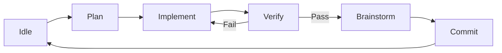

<div align="center">

# Agent Pump ⛽

### The Automated AI Coding Orchestrator

[](https://www.python.org/downloads/release/python-3120/)
[](https://opensource.org/licenses/MIT)
[](https://github.com/astral-sh/ruff)
[](https://github.com/Textualize/textual)

**Stop copying and pasting code. Start orchestrating intelligence.**

[Quick Start](#quick-start) • 
[Features](#features) • 
[How It Works](#how-it-works) • 
[Documentation](#documentation)

</div>

---

## Introduction

**Agent Pump** is a terminal-based orchestration platform that turns your AI coding assistants into autonomous agents.

Instead of treating AI as a chatbot where you copy-paste snippets back and forth, Agent Pump puts the AI in a **Workflow Loop**. You define the endpoint (the `ROADMAP.md`), and Agent Pump drives the AI through a rigorous 5-phase engineering process until the feature is built, tested, and committed.

It feels less like "chatting with a bot" and more like **pair programming with a senior engineer** who types really, really fast.

---

## Features

- 🚀 **Autonomous Workflow Loop** — Cycles through Plan → Implement → Verify → Brainstorm → Commit
- 🖥️ **Beautiful TUI Dashboard** — Monitor multiple projects simultaneously with Textual
- 🌐 **HTTP API & WebSocket** — Remote monitoring, API access, and real-time updates
- 🧠 **Pluggable Backends** — Gemini, Claude Code, OpenCode, and Qwen with fallback chains
- ✅ **Automated Verification** — Runs tests, linters, and builds; auto-fixes failures
- 📝 **Living Roadmap** — The agent reads `ROADMAP.md` to decide what to work on next
- 🌿 **Git Branch Strategy** — Automatic feature branches with optional auto-merge
- 💰 **Cost Tracking** — Monitor API spending with budget limits and alerts
- 🎭 **Dry Run Mode** — Preview changes without modifying files
- 🔄 **Checkpoint Rollback** — Save and restore project states at any point

See [FEATURES.md](FEATURES.md) for the complete feature list with configuration examples.

---

## Quick Start

```bash
# Clone and install
git clone https://github.com/yourusername/agent-pump.git
cd agent-pump
uv sync

# Launch the TUI
uv run agent-pump
```

### Your First Project

1. Ensure your project has a `ROADMAP.md` with a "Current Sprint" section:
   ```markdown
   ## Current Sprint
   ### 🔴 Add Login Page
   Create a login page with email and password fields.
   ```

2. Press `a` in the TUI to add your project directory
3. Press `s` to start the workflow
4. Watch as Agent Pump plans, implements, verifies, and commits

### Key Bindings

| Key | Action |
|-----|--------|
| `a` | Add project |
| `s` / `x` | Start / Stop workflow |
| `?` | Chat with project |
| `b` | Configure backend |
| `m` | Manage roadmap |
| `Ctrl+P` | Command palette |
| `Escape` | Quit |

---

## How It Works

Agent Pump implements a state machine that models the software engineering lifecycle:



1. **Plan** — Analyzes the codebase and creates an implementation plan
2. **Implement** — Writes code following the plan
3. **Verify** — Runs tests and linters; loops back on failure
4. **Brainstorm** — Reviews work and updates the roadmap
5. **Commit** — Stages and commits with a conventional commit message

---

## CLI Reference

```bash
# Project management
uv run agent-pump project add ./my-project
uv run agent-pump project list
uv run agent-pump project bootstrap ./my-project

# Chat with your codebase
uv run agent-pump ask "How does the event bus work?" ./my-project

# Web server mode
uv run agent-pump --web --web-port 8080

# Headless mode (CI/CD)
uv run agent-pump ./my-project --headless --dry-run
```

---

## Development

### Prerequisites

- **Python 3.12+**
- **uv** — [Install uv](https://github.com/astral-sh/uv)

### Setup & Testing

```bash
git clone https://github.com/yourusername/agent-pump.git
cd agent-pump
uv sync

# Run tests
uv run pytest tests/ -v

# Lint & type check
uv run ruff check .
uv run pyright
```

---

## Documentation

| Document | Description |
|----------|-------------|
| [FEATURES.md](FEATURES.md) | Complete feature list with configuration examples |
| [BEST_PRACTICES.md](BEST_PRACTICES.md) | Engineering philosophy and coding standards |
| [ROADMAP.md](ROADMAP.md) | Active development plan |
| [docs/api.md](docs/api.md) | HTTP API documentation |

---

## Contributing

We're building the future of agentic coding. Contributions welcome!

Please read [BEST_PRACTICES.md](BEST_PRACTICES.md) before submitting a PR.

---

<div align="center">
<sub>Yes, we use Agent Pump to build Agent Pump. 🤯</sub>
</div>
